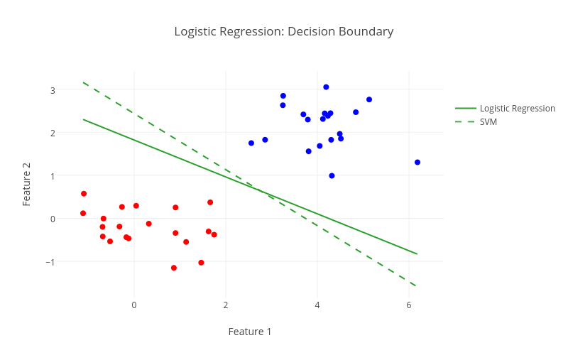
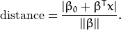
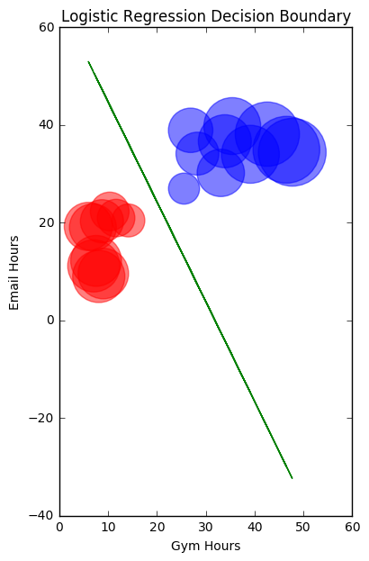
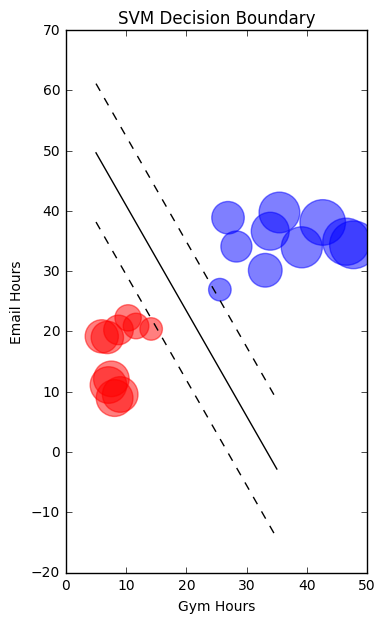
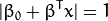
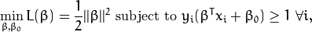

**Include your code and answers in** `individual.py`.

# Introduction: Support Vector Machine (SVM)

The support vector machine is a maximal margin classifier that seeks to construct a hyperplane that linearly separates training observations of one class from the other class. To aid the learning process, we'll demonstrate how logistic regression compares to SVMs when separating classes (see image below).

For this individual assignment, we will only consider the case where the two classes are linearly separable. In most applications, classes are not linearly separable from one another, and the hinge loss function (covered in the afternoon) would have to be taken into account as well.

<div align="center">
    
</div>

1\. Use the template that is provided for you in `src/logit_svm_margin.py` to complete this exercise.

2\. You are given a dataset about the weekly hours spent in gym and spent emailing for data scientist and non data scientist. Load the file `data/data_scientist.csv` into a dataframe. **Note**: for consistency of your plots, be sure to use 'gym_hours' as first attribute and 'email_hours' as second.


# Part 1: Margin of Logistic Regression Boundary

Logistic Regression is similar to the Support Vector Machine, except Logistic Regression minimizes [logistic loss (See diagram in 1.4)](http://www.stat.ucla.edu/~ywu/AB/adjust.html) and does not explicitly maximize the margin. We will here use the `LogisticRegression` from `sklearn` and plot its decision boundaries on a scatter plot of the data and their classes.

1\. Implement the function `plot_data_basic` to make a scatter plot of `gym_hours` against `email_hours` where each of the two labels should be of a different color. `plt.scatter` takes a `color` argument which can be specified as a list of colors.

2\. Fit `LogisticRegression` with `gym_hours` and `email_hours` as features and `data_scientist` as the response.

3\. Implement the function `plot_logit_decision` to compute and plot the decision boundary. Remember `y` is `0` at the decision boundary when the probability of a positive class is `0.5`. So, you can define a range over one of your features (`gym_hours` for example) and compute the corresponding value for the other (`email_hours`) at the decision boundary. To do that, you will need to access the weights computed by `LogisticRegression`.

Use that function to plot your decision boundaries. Try to modify `intercept_scaling` in the parameters of `LogisticRegression`.

4\. The distance from the decision boundary is defined as below, where  is the L2 norm of beta coefficients of the logistic regression. Read more under the [Large margin classification mathematics](http://www.holehouse.org/mlclass/12_Support_Vector_Machines.html) section if you are interested in derivations of the margin formulation.

   

   Implement the function `calc_logreg_margin` to compute and return the distance of each of the points from the decision boundary. Compute the sum of these distances.

5\. Modify the `plot_logit_decision` function from question 3 to accept a `label_sizes` argument, where the size of the scatter points will be determined by the distance of the data point from the decision boundary. `plt.scatter` takes a `s` argument of a list of marker sizes. For the marker size to be in the right range, the distance should be multiplied by `100`.

      


# Part 2: Margin of Support Vector Machine Boundary

SVM is a maximal margin classifier which in theory would have a larger margin than Logistic Regression. Let's verify the theory.

1\. Fit the classifier `SVC` (from `sklearn`) with `gym_hours` and `email_hours` as features and `data_scientist` as the response. Use a `'linear'` kernel.

2\. Use the following function to plot the `SVC` decision boundary.

```python
def plot_svm_decision(svc_clf, X, y, label_sizes=None):
    w = svc_clf.svm.coef_[0]
    a = -w[0] / w[1]
    xx = np.linspace(5, 35)
    yy = a * xx - (svc_clf.intercept_[0]) / w[1]

    # plot the parallels to the separating hyperplane that pass through the
    # support vectors
    margin = 1 / np.sqrt(np.sum(svc_clf.coef_ ** 2))
    yy_down = yy + a * margin
    yy_up = yy - a * margin

    # plot the line, the points, and the nearest vectors to the plane
    colors = ['red' if x else 'blue' for x in y]
    fig = plt.figure(figsize=(10,7))
    ax = fig.add_subplot(111)

    # if label_sizes are provided, use that as an argument of ax.scatter
    if (label_sizes is not None) :
        ax.scatter(X[:,0], X[:,1], color=colors, s=label_sizes, alpha=0.5)
    else:
        ax.scatter(X[:,0], X[:,1], color=colors, alpha=0.5)

    ax.plot(xx, yy, 'k-')
    ax.plot(xx, yy_down, 'k--')
    ax.plot(xx, yy_up, 'k--')
    plt.title('SVM Decision Boundary')
    plt.xlabel('Gym Hours')
    plt.ylabel('Email Hours')
    plt.show()
```

3\. Implement the function `calc_svm_margin` to compute and return the distance of each of the points from the decision boundary. Compute the sum of these distances.

4\. Using function `plot_svm_decision`, Make another plot where the size of scatter points indicates the size of the distances from the SVC decision boundary.
   

5\. What is the advantage of having a large margin? Compare the Logistic case vs. the SVM case, for a data scientist who emails 2.5 hours a week and gyms for 10 hours.


# Extra Credit: Write your own maximal margin optimizer

1\. **Optional:** In order to find the beta coefficients that would maximize the margin, below are the formulations for the parameter space and the loss function.


   Parameter Space:

   

   Loss Function:

   

   Write a function that would take a random set of beta coefficients and optimize towards the set of beta coefficients that would maximize the margin.
